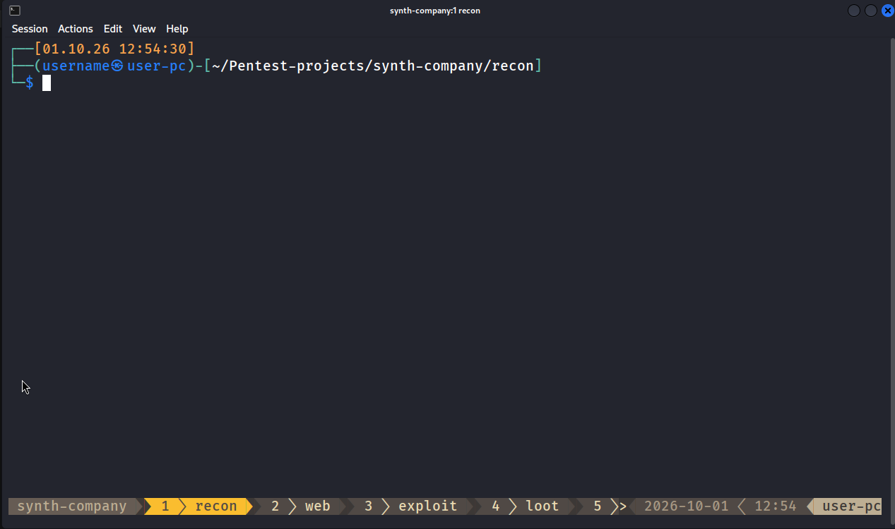

# RED-TMUX

Переработанный конфиг tmux и zsh под Kali Linux для пентеста и экзаменов (CPTS, OSCP, CTF). Внутри: удобные бинды на Alt, поддержка мыши, дата и время в приглашении, тема gruvbox, автосейв раскладки и аккуратное логирование. В файл пишется читаемый лог терминала вместо каши из ANSI и автодополнений.

Рассчитан на Kali и zsh, но работает на любом Linux с tmux 3.2+ и zsh. Разбор по частям ниже.



## Зачем

tmux-logging, pipe-pane и script пишут сырой поток с управляющими последовательностями. Когда включены zsh-autosuggestions и подсветка, строка команды перерисовывается на каждое нажатие. Обычный `cat /etc/passwd` в таком логе выглядит так (`^[` обозначает байт Esc):

```
└─$ ^[[?1h^[=c c c ^[[38;5;244mlear  ca  ca ^[[38;5;244mt /etc/passwd^[[13D  cat  cat t  t / /etc/passwd^[[11D/etc/passwd^[[?1l^[>
root:x:0:0:root:/root:/usr/bin/zsh
daemon:x:1:1:daemon:/usr/sbin:/usr/sbin/nologin
bin:x:2:2:bin:/bin:/usr/sbin/nologin
^[[0m^[[27m^[[24m^[[J^[[32m┌──(^[[1m^[[34musername㉿user-pc^[[0m^[[32m)-[^[[39m~^[[32m]
└─^[[1m^[[34m$^[[0m ^[[K^[[?2004hp ^[[4mp^[[38;5;244mwd^[[39m ^[[4mp^[[4mw^[[4md^[[?2004l
/home/username
```

Что здесь за мусор:

- `^[[38;5;244m…` : серый текст автоподсказки (zsh-autosuggestions);
- `p p pwd … p w d` : строка перерисовывается на каждое нажатие плюс подсветка набора;
- `^[[13D`, `^[[K` : сдвиг курсора и очистка до конца строки;
- `^[[?2004h`, `^[[?1h`, `^[=`, `^[>` : bracketed paste и режимы клавиатуры;
- `^[[32m`, `^[[1m`, `^[[0m` : цвета и жирный.

Перед сдачей отчёта это приходится вычищать руками.

Здесь лог снимается иначе: после каждой команды берётся готовый текст экрана через `tmux capture-pane`. Те же команды в файле выглядят так же, как на экране:

```
┌──(username㉿user-pc)-[~]
└─$ cat /etc/passwd
root:x:0:0:root:/root:/usr/bin/zsh
daemon:x:1:1:daemon:/usr/sbin:/usr/sbin/nologin
bin:x:2:2:bin:/bin:/usr/sbin/nologin

┌──(username㉿user-pc)-[~]
└─$ pwd
/home/username
```

## Удобный tmux

Помимо лога это ещё и приятная среда из коробки: мышь, 256 цветов (truecolor), большой скроллбэк (500k строк), автосейв раскладки и почти все действия на Alt без префикса.

| Клавиши | Действие |
|---|---|
| `Alt+Enter` | новое окно в текущем каталоге плюс сразу переименование; Enter оставляет дефолт |
| `Alt+h` / `Alt+v` | сплит по горизонтали / вертикали |
| `Alt+←↑↓→` | переход между панелями |
| `Alt+Shift+←↑↓→` | ресайз панели |
| `Alt+1..9`, `` Alt+` `` | переключить окно (`` ` `` для окна 1) |
| `Alt+,` | переименовать окно |
| `Alt+q` / `Alt+c` | убить окно / панель (спросит) |
| `Alt+d` | detach |
| `Alt+s` | дерево сессий |
| `Alt+r` | перечитать конфиг |
| `Alt+/` / `Alt+?` | поиск в буфере вниз / вверх |

Префикс это `Ctrl-b`. `prefix + Ctrl-r` и `Ctrl-s` восстанавливают и сохраняют раскладку, `prefix + I` ставит плагины. Копирование мышью уходит в буфер tmux. Чтобы скопировать в буфер хоста или ВМ, держите `Shift` при выделении.

### Тема

Статус-бар оформлен в [gruvbox](https://github.com/egel/tmux-gruvbox). Вариант задаётся в `tmux.conf`:

```tmux
set -g @tmux-gruvbox 'dark'   # dark | dark256 | light
```

`dark` для truecolor (включён по умолчанию), `dark256` для терминала без truecolor, `light` светлый. После смены нажмите `prefix + I` (если плагин ещё не ставился) и `Alt+r`, чтобы перечитать конфиг.

## Установка

```
git clone https://github.com/5yn7hp0w3r/RED-TMUX ~/RED-TMUX
cd ~/RED-TMUX
./install.sh
```

Без симлинков. Скрипт создаёт `~/logs`, ставит TPM, копирует `tmux.conf` в `~/.tmux.conf` (бинды, мышь, gruvbox, автосейв) и дописывает лог в конец `~/.zshrc` между маркерами `# >>> RED-TMUX >>>`. Оригиналы сохраняются в бэкап (`.bak.<дата>`), повторный запуск заменяет свой блок, а не плодит копии.

Тема и чистый лог ставятся всегда, остальное скрипт спросит (Enter принимает дефолт, он указан в CAPS):

- `Ставить промпт с датой/временем?` добавит дату и время в приглашение (по умолчанию да);
- `Ставить команду pentest (быстрый старт проекта)?` добавит команду `pentest` (по умолчанию да);
- `Чинить перехват Alt+1..9 в qterminal?` уберёт эти бинды из `qterminal.ini` (по умолчанию да; qterminal при этом закройте, иначе он перепишет файл на выходе);
- `Ставить шрифт qterminal (Fira Code Medium, 16)?` пропишет шрифт и размер (по умолчанию нет; нужен установленный Fira Code).

Флаги: `-y` принимает все дефолты без вопросов, `--no-conf` не трогает `~/.tmux.conf`. После установки откройте новый терминал, запустите `tmux` и один раз нажмите `prefix + I`.

Если ставите вручную, без скрипта:

- `cp tmux.conf ~/.tmux.conf`;
- в конец `~/.zshrc` допишите содержимое `zsh/red-tmux.zsh` (и при желании `zsh/prompt-report.zsh`), либо подключите их через `source`;
- `git clone https://github.com/tmux-plugins/tpm ~/.tmux/plugins/tpm`, затем `prefix + I`.

## Логи

Пишутся сами, в каждой панели, начиная с первой команды:

```
~/logs/
└── work/                       # имя сессии
    ├── 1.1-20261001_043043.log # окно 1, панель 1
    └── 2.1-20261001_043346.log # окно 2, панель 1
```

Файл заводится только после первой реальной команды, поэтому пустые и служебные панели не плодят болванки.

Лог это снимок буфера прокрутки, поэтому он держит до `history-limit` строк на панель (в конфиге 500k). Это потолок, а не резерв: память растёт только по мере вывода. Для долгих сессий поднимите лимит в `tmux.conf`.

Каталог логов можно сменить до `source` в `.zshrc`:

```zsh
RED_TMUX_LOGDIR=/evidence/$(date +%F)
source ~/RED-TMUX/zsh/red-tmux.zsh
```

### Время в промпте

Опциональный модуль добавляет к приглашению строку `[дата время]`. Лог снимает экран, поэтому таймстамп ложится рядом с каждой командой, и потом видно, когда что выполнено:

```
┌──[01.10.26 05:16:54]
├──(user㉿host)-[~]
└─$
```

`install.sh` предлагает его на установке (по умолчанию да). Вручную допишите содержимое `zsh/prompt-report.zsh` в конец `~/.zshrc` (после дефолтного prompt-блока Kali) или подключите через `source`. Переключатель `Ctrl-P` (oneline/twoline) при этом остаётся.

## Проекты (команда pentest)

Опциональный модуль. Команда `pentest` за один шаг разворачивает проект: папки, tmux-сессию с вкладками и переменную `RHOST`.

```
$ pentest
Project name: roga-llc
RHOST (Enter чтобы пропустить): 10.10.11.42
```

Что происходит:

- создаётся `~/Pentest-projects/roga-llc/` с подпапками `recon web loot creds exploit report`;
- поднимается tmux-сессия `roga-llc` с вкладками `recon web exploit loot notes`;
- каждая вкладка открывается в своей одноимённой подпапке (у `notes` её нет, поэтому корень проекта);
- `RHOST` попадает в окружение сессии, поэтому `$RHOST` виден во всех вкладках.

Имя можно передать сразу: `pentest roga-llc`. Если сессия с таким именем уже есть, команда просто подключит вас к ней.

Имя сессии совпадает с именем проекта, поэтому логи тоже лягут в `~/logs/roga-llc/`, то есть по проекту всё в одном месте.

Наборы настраиваются в начале `zsh/pentest-session.zsh` (или в `~/.zshrc` до `source`):

```zsh
PENTEST_ROOT=~/Pentest-projects
PENTEST_WINDOWS=(recon web exploit loot notes)
PENTEST_DIRS=(recon web loot creds exploit report)
```

## Сессии после ребута

Здесь легко обмануться, поэтому по порядку.

Сервер tmux живёт в оперативной памяти. **Ребут гасит сервер, и все живые сессии исчезают.** Detach тут не помогает: он спасает, только пока машина включена (закрыли терминал или отвалился SSH, а сессия крутится в фоне), но ребут убивает её вместе с сервером. Поэтому пустой `tmux ls` сразу после загрузки это норма, а не поломка.

Ребут переживает только **снимок раскладки на диске**, который continuum пишет каждые 15 минут:

```
~/.local/share/tmux/resurrect/tmux_resurrect_*.txt
```

Это текст: сессии, окна, панели, рабочие каталоги. Сами живые сессии не сохраняются, сохраняется только их «чертёж».

Автовосстановление намеренно **выключено** (`@continuum-restore 'off'`), иначе любой `tmux new` на холодный сервер тянул бы старые сессии рядом с новой. Поэтому после ребута раскладка поднимается **вручную**:

```
tmux               # поднять сервер (пустой это ок)
prefix + Ctrl-r    # восстановить раскладку из последнего снимка
prefix + Ctrl-s    # сохранить прямо сейчас (например, перед плановым ребутом)
```

Именно шага `prefix + Ctrl-r` обычно и не хватает, когда «сессия пропала».

Что держать в голове:

- восстанавливается **последний автосейв** (раз в 15 минут). Если вы создали сессию и ребутнулись раньше, в снимке её ещё нет. Перед ребутом нажмите `prefix + Ctrl-s`;
- возвращается **структура**: окна, панели, раскладка, каталоги (и программы из белого списка, если включить). Живой вывод, скроллбэк и состояние процессов не возвращаются. Это «то же рабочее место», а не замороженная сессия;
- снимок лежит на конкретной машине. На другой ВМ своего `~/.local/share/tmux/resurrect/` нет, восстанавливать нечего;
- проверить снимки: `ls -lt ~/.local/share/tmux/resurrect/`.

Старые лог-файлы ребут и рестор не трогают: они остаются в `~/logs/<сессия>/`, а работа после восстановления пишется в новый файл рядом.

Если хотите, чтобы раскладка вставала сама после ребута, поставьте `@continuum-restore 'on'` в `tmux.conf`. Плата за это: `tmux new` на холодный сервер снова будет вытаскивать сохранённые сессии.

## Файлы

```
RED-TMUX/
├── tmux.conf              конфиг tmux (копируется в ~/.tmux.conf)
├── zsh/red-tmux.zsh         логирование: source из ~/.zshrc
├── zsh/prompt-report.zsh    опциональный промпт с датой/временем
├── zsh/pentest-session.zsh  опциональная команда pentest
├── install.sh               установщик
├── README.md
└── LICENSE
```

## Если что-то не так

- Логов нет: проверьте, что вы внутри tmux (`echo $TMUX`) и что в `~/.zshrc` есть `source .../red-tmux.zsh`. Для уже открытых панелей выполните `source ~/.zshrc`.
- `tmux new` тянет старые сессии: в конфиге должно быть `@continuum-restore 'off'`.
- Первое окно без цвета: нужно `@resurrect-capture-pane-contents 'off'`.
- Нет цветов вообще: терминал должен уметь 256 цветов или truecolor, проверьте `$TERM` снаружи tmux.
- `Alt+1..9` не переключают окна: терминал перехватывает их под свои вкладки. Лечится в терминале. qterminal (дефолт Kali) закройте полностью, затем из другого терминала или tty:

  ```bash
  sed -i.bak -E 's/^([^=]*)=Alt\+[1-9]$/\1=/' ~/.config/qterminal.org/qterminal.ini
  ```

  Бэкап ляжет рядом. На этот случай в конфиге есть запасной `` Alt+` `` для перехода к окну 1.

## Версия tmux

Проверить свою версию:

```bash
tmux -V
```

Проверено и работает: **tmux 3.5a** и **3.6b**. Регрессия появилась в **3.7b**.

Осторожно с **tmux 3.7b-1** из `kali-rolling` (прилетает обычным `apt upgrade`). В этой сборке замечена регрессия в отрисовке статус-бара: при нескольких окнах список окон снизу «пропадает», и выглядит это так, будто больше 3–4 вкладок не создаётся (хотя `tmux list-windows` показывает, что окна на месте). К конфигу это отношения не имеет, воспроизводится на голом tmux без конфигов.

Не стоит ради этого вовсе отказываться от обновлений. Заморозьте только tmux, а остальное обновляйте как обычно:

```bash
sudo apt-mark hold tmux      # tmux не будет апгрейдиться
apt-mark showhold            # проверить, что заморожено
sudo apt-mark unhold tmux    # снять, когда выйдет исправленная версия
```

Если словили это на 3.7b, откатитесь на 3.5a и зафиксируйте версию:

```bash
# поставить known-good .deb (например, перенесённый с рабочей машины)
sudo apt purge -y tmux
sudo dpkg -i tmux_3.5a-3_amd64.deb
sudo apt-mark hold tmux      # чтобы apt снова не поднял до битой версии
tmux -V                      # должно показать 3.5a
```

Либо собрать 3.5a из исходников:

```bash
sudo apt install -y build-essential libevent-dev libncurses-dev bison pkg-config wget
wget https://github.com/tmux/tmux/releases/download/3.5a/tmux-3.5a.tar.gz
tar xzf tmux-3.5a.tar.gz && cd tmux-3.5a && ./configure && make && sudo make install
hash -r; tmux -V
```

## Лицензия

MIT.
